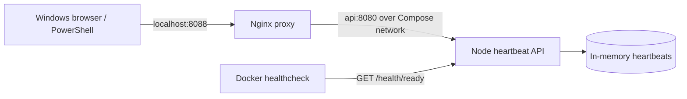

# Architecture sketch

```mermaid
flowchart LR
    U[Windows browser / PowerShell] -->|localhost:8088| P[Nginx proxy]
    P -->|api:8080 over Compose network| A[Node heartbeat API]
    H[Docker healthcheck] -->|GET /health/ready| A
    A --> M[(In-memory heartbeats)]
```

There is no separate database in this exercise. A container restart loses the in-memory heartbeats, which is part of the lesson.
